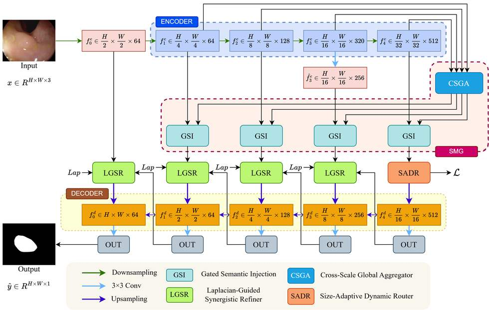
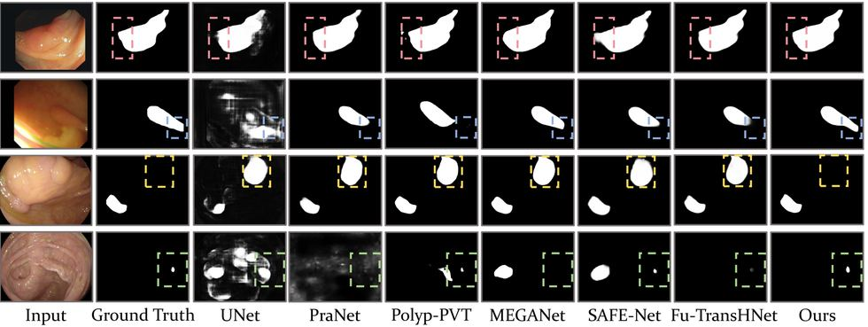

# SCA-Net: A Scale- and Contrast-Aware Network for Subtle and Low-Contrast Polyp Segmentation

This repository contains the PyTorch implementation of **SCA-Net**, a scale- and contrast-aware framework for robust polyp segmentation under substantial scale variation and low-contrast boundary conditions.

## Method

<p align="center">
  
</p>

SCA-Net follows an encoder-decoder design and integrates three complementary components:

- **Semantic Module Group (SMG)**, consisting of a Cross-Scale Global Aggregator (CSGA) and Gated Semantic Injection (GSI), builds a shared cross-scale semantic token space and injects aggregated context into stage-wise features through gated residual modulation.
- **Size-Adaptive Dynamic Router (SADR)** introduces a scale-supervised soft routing mechanism that uses mask-derived size labels to adaptively balance receptive-field experts according to object scale.
- **Laplacian-Guided Synergistic Refiner (LGSR)** structurally couples reverse semantic guidance, Laplacian-guided edge modulation, and local-context fusion to improve boundary localization for weakly demarcated lesions.

Through this coordinated design, SCA-Net aims to produce more discriminative, scale-adaptive, and boundary-sensitive representations for subtle and low-contrast polyp segmentation scenarios.

## Results

Experiments are conducted on five public polyp segmentation datasets: Kvasir-SEG, CVC-ClinicDB, CVC-300, CVC-ColonDB, and ETIS-LaribPolypDB. Following the common protocol, 900 images from Kvasir-SEG and 550 images from CVC-ClinicDB are used for training, while CVC-300, CVC-ColonDB, and ETIS-LaribPolypDB are used as unseen datasets for cross-dataset generalization.

| Dataset | Setting | Backbone | mDice (%) | mIoU (%) |
|---|---:|---|---:|---:|
| CVC-ClinicDB | Seen | ConvNeXt-T | 94.7 | 90.3 |
| Kvasir-SEG | Seen | ConvNeXt-T | 93.3 | 88.7 |
| CVC-300 | Unseen | ConvNeXt-B | 92.1 | 86.2 |
| CVC-ColonDB | Unseen | PVTv2-B4 | 81.2 | 73.4 |
| ETIS-LaribPolypDB | Unseen | PVTv2-B4 | 86.0 | 78.7 |

On the challenging unseen ETIS-LaribPolypDB dataset, SCA-Net with a PVTv2-B4 backbone achieves **86.0% mDice** and **78.7% mIoU**.

<p align="center">
  
</p>


The qualitative results cover challenging cases involving irregular boundaries, small or elongated structures, subtle appearance, and extremely small targets. Compared with competing methods, SCA-Net yields more complete foreground prediction, clearer boundary continuity, and fewer false activations in challenging regions.

## Installation

Recommended environment:

- Python 3.10.15
- PyTorch 2.10.0
- CUDA 12.8

Install dependencies:

```bash
pip install -r requirements.txt
```

Install the CUDA-enabled PyTorch build that matches your local CUDA toolkit or driver.

## Data Preparation

The dataset settings are consistent with the common polyp segmentation protocol. Place the datasets under `data/` with the following structure:

```text
data/
  TrainDataset/
    images/
    masks/
  TestDataset/
    CVC-300/
      images/
      masks/
    CVC-ClinicDB/
      images/
      masks/
    Kvasir/
      images/
      masks/
    CVC-ColonDB/
      images/
      masks/
    ETIS-LaribPolypDB/
      images/
      masks/
```

## Training and Evaluation

Train SCA-Net:

```bash
python train.py
```

Run prediction:

```bash
python predict.py --checkpoint ./checkpoints/sca_net/epoch_100.pth
```

Evaluate predictions:

```bash
python evaluate.py --pred-root ./results/sca_net
```

## Checkpoints

The checkpoint will be released after the paper is published.
